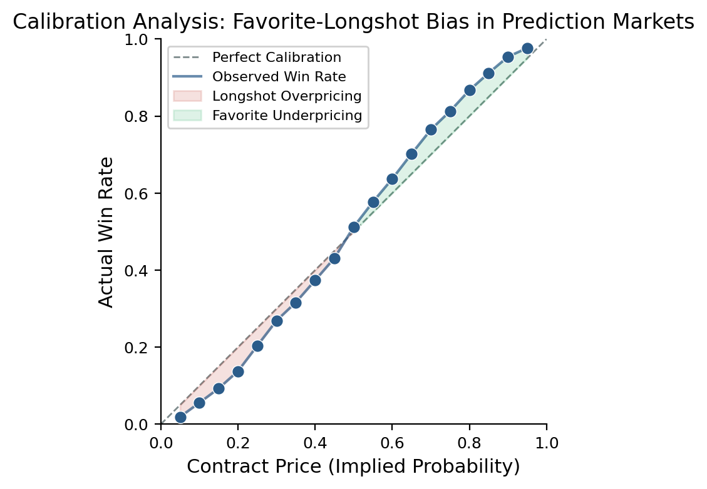
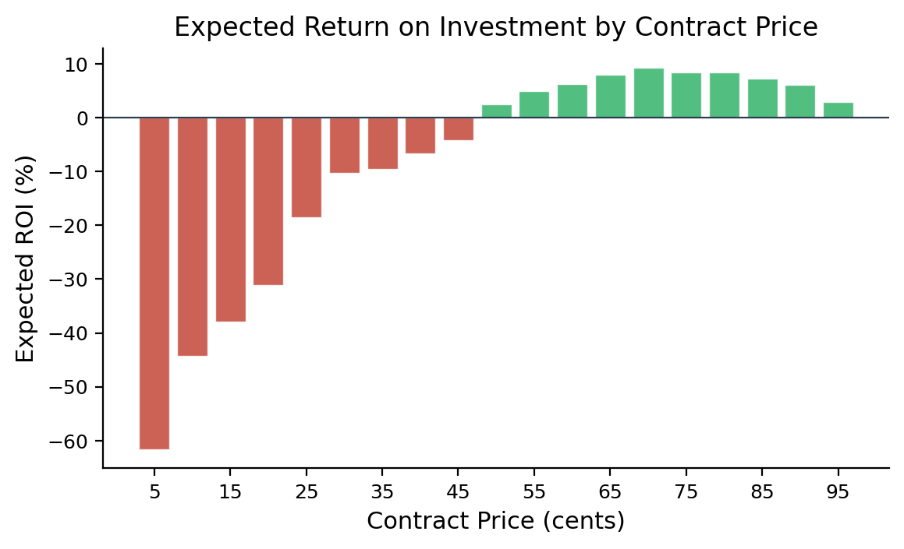
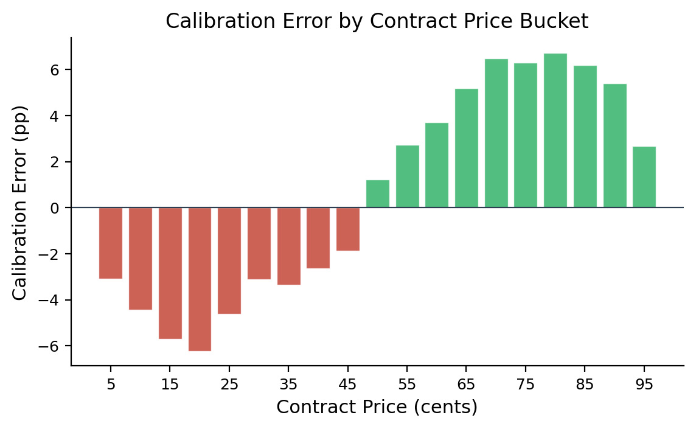

# Calibration Analysis of Binary Event Contracts in Prediction Markets

[](https://www.python.org/downloads/)
[](LICENSE)

**Research paper and analytical framework examining whether prediction market contract prices accurately reflect outcome probabilities, with focus on the favorite-longshot bias in CFTC-regulated exchanges.**

<p align="center">
  
</p>

## Overview

Prediction markets aggregate information by allowing participants to trade contracts whose payoffs depend on future event outcomes. A contract priced at 60 cents *should* correspond to an event occurring ~60% of the time. This project tests that assumption.

### Key Findings

- **Favorite-longshot bias confirmed**: Low-price contracts (5-25c) win significantly *less* than their price implies; high-price contracts (75-95c) win *more*
- **Asymmetric returns**: Longshot buyers face -30% to -58% expected ROI; favorite buyers earn +2% to +6%
- **Calibration crossover at 50c**: The bias is approximately symmetric around the midpoint
- **Market design implications**: Fee structures, maker-taker dynamics, and order book transparency all influence calibration accuracy

### Research Context

This analysis is modeled on empirically documented patterns from:
- Burgi, Deng & Whelan (2026). "Makers and Takers: The Economics of the Kalshi Prediction Market." *CEPR Discussion Paper No. 20631*
- Arrow et al. (2008). "The Promise of Prediction Markets." *Science*, 320(5878)
- Ottaviani & Sorensen (2008). "The Favorite-Longshot Bias." *Handbook of Sports and Lottery Markets*

## Project Structure

```
prediction-market-calibration-analysis/
├── README.md
├── requirements.txt
├── LICENSE
├── paper/
│   └── Kalshi_Prediction_Market_Calibration_Analysis.pdf
├── src/
│   ├── data_generation.py          # Synthetic data calibrated to empirical patterns
│   ├── calibration_analysis.py     # Core statistical analysis
│   ├── visualizations.py           # Publication-quality figures
│   └── utils.py                    # Helper functions
├── notebooks/
│   └── full_analysis.ipynb         # End-to-end Jupyter notebook
├── figures/
│   ├── fig1_calibration.png
│   ├── fig2_roi.png
│   └── fig3_calibration_error.png
└── data/
    └── simulated_contracts.csv
```

## Quick Start

```bash
# Clone the repo
git clone https://github.com/JayDS22/prediction-market-calibration-analysis.git
cd prediction-market-calibration-analysis

# Install dependencies
pip install -r requirements.txt

# Run the full analysis
python src/calibration_analysis.py

# Or explore interactively
jupyter notebook notebooks/full_analysis.ipynb
```

## Methodology

### Data

Simulated dataset of **115,400 binary event contracts** across 19 price buckets (5c to 95c), with win rates calibrated to empirically documented favorite-longshot bias patterns from CFTC-regulated prediction markets.

### Metrics

| Metric | Formula | Description |
|--------|---------|-------------|
| Implied Probability | `P_implied = Price / 100` | Market's estimate of event probability |
| Calibration Error | `CE = Win_Rate - P_implied` | Negative = overpricing |
| Expected ROI | `(Win_Rate / P_implied - 1) * 100` | Average return per dollar invested |
| Brier Score | `mean((forecast - outcome)^2)` | Overall calibration quality |

### Statistical Validation

- Binomial proportion confidence intervals (95%) for win rates
- Chi-squared goodness-of-fit test for calibration
- Bootstrap resampling (10,000 iterations) for ROI confidence intervals

## Results Summary

| Price Range | Implied Prob | Actual Win Rate | Calibration Error | Avg ROI |
|-------------|-------------|-----------------|-------------------|---------|
| 5c - 25c (Longshots) | 15.0% | 10.4% | -4.6pp | -30.4% |
| 30c - 45c (Mid-Low) | 37.5% | 34.1% | -3.4pp | -8.9% |
| 50c (Fair) | 50.0% | 50.0% | 0.0pp | 0.0% |
| 55c - 70c (Mid-High) | 62.5% | 65.5% | +3.0pp | +4.7% |
| 75c - 95c (Favorites) | 85.0% | 90.3% | +5.3pp | +6.2% |

## Visualizations

### Calibration Plot


### ROI by Contract Price


### Calibration Error Decomposition


## Future Work

- **Live data integration**: Connect to Kalshi's public API for real-time calibration monitoring
- **Category-level analysis**: Compare bias magnitude across politics, economics, weather, and sports contracts
- **Temporal dynamics**: Track how calibration improves as contract expiry approaches
- **Maker-taker decomposition**: Analyze whether bias differs for price-setters vs. price-takers
- **Recalibration models**: Develop isotonic regression and Platt scaling methods to correct market prices

## Tech Stack

- **Analysis**: Python, Pandas, NumPy, SciPy, Statsmodels
- **Visualization**: Matplotlib, Plotly, Seaborn
- **Interactive Dashboard**: Streamlit (planned)
- **Data Pipeline**: SQL, Airflow (for production-scale extension)

## Author

**Jay Guwalani**
M.S. Data Science, University of Maryland, College Park
[jguwalan@umd.edu](mailto:jguwalan@umd.edu) | [LinkedIn](https://linkedin.com/in/j-guwalani) | [Portfolio](https://jayds22.github.io/Portfolio/)

## License

This project is licensed under the MIT License - see [LICENSE](LICENSE) for details.

## Citation

If you use this analysis or framework, please cite:

```bibtex
@misc{guwalani2026calibration,
  author = {Guwalani, Jay},
  title = {Calibration Analysis of Binary Event Contracts in Prediction Markets},
  year = {2026},
  publisher = {GitHub},
  url = {https://github.com/JayDS22/prediction-market-calibration-analysis}
}
```
